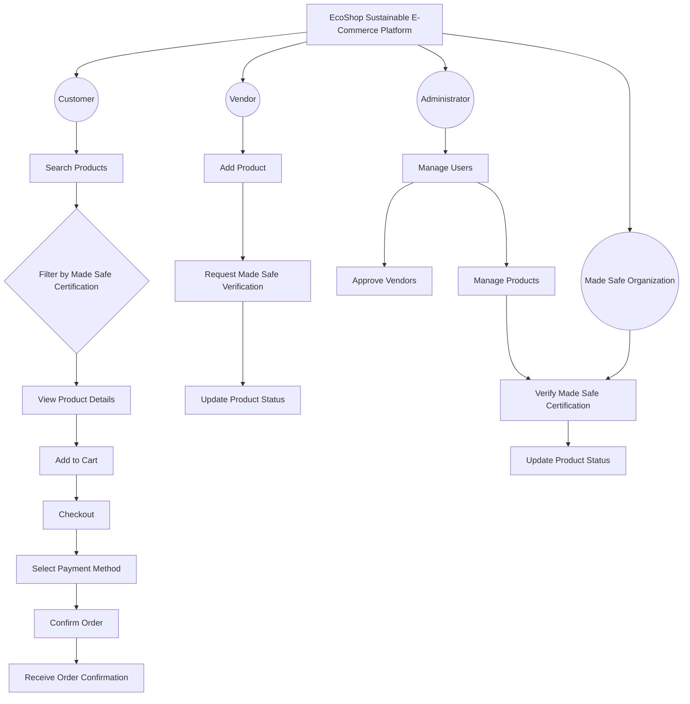
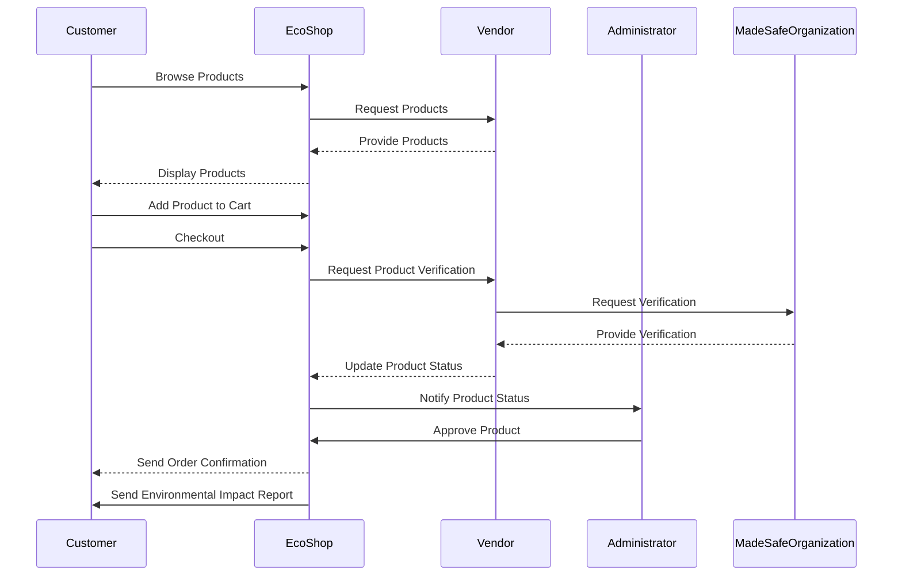

# Ecoshop

A sustainable e-commerce application built with Vue.js 3, Tailwind CSS, and Firebase.

## Overview

This project is a comprehensive e-commerce app with a custom-built frontend and backend. It includes various features such as user authentication, product management, shopping cart functionality, order management, and data visualization.

### User Side

### Admin Side

## Technologies

Project is created with:

- Vue.js 3 (Composition API)
- Tailwind CSS
- Firebase (Authentication, Firestore, Storage, and Functions)
- Algolia Search
- Chart.js

## Installation

1. Create a Firebase account: https://firebase.google.com/
2. Create an Algolia account: https://www.algolia.com/
3. Rename `.envSample` to `.env` and fill it with your Firebase and Algolia credentials.
4. Run `npm install`

## Diagrams

### Use Case Diagram

### Sequence Diagram

## Info
All the products in the app are fake and for demonstration purposes only. If you proceed with an order, you will not be charged.
